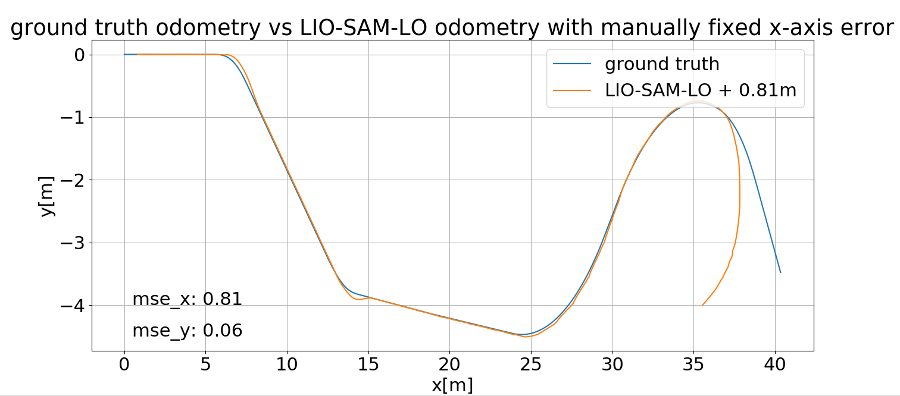

# ROS exercise
This repository is a notebook about trying to solve a proposed exercise using __ROS Noetic__ with a __Polaris gem e2__ robot simulator in __gazebo__ and available __SLAM__ library.

The steps to reproduce all the results are described in this video [how-to-reproduce.mp4](https://drive.google.com/drive/folders/1EkXp5G8VEJRu8eVFWPyHbI31-YVU9Hka) which is also mentionned in section [9. How to reproduce](#9-how-to-reproduce-the-results)

## Exercise tasks
1. Install the POLARIS GEM e2 simulator and apply the noetic joined [patch_gem_simulation](patch/patch_gem_simulation) update.
2. Integrate the LIO-SAM SLAM library into the simulation and apply the joined [patch_liosam](patch/patch_liosam) to handle ROS Noetic.
3. Create a map of the area using LIO-SAM
4. Modify the LIO-SAM to be able to use the generated map instead of building a new one.
    - Implementing a mechanism to load the map into the system at startup. This might involve parsing the map data and initializing certain data structures like a KD-tree.
    - LIO-SAM, as it currently stands, performs scan-matching with recent lidar scans. You would need to modify this to match incoming scans against the pre-built map.
5. Run the modified LIO-SAM using the same pre-built map and compare the results of your localization algorithm with the ground truth from the
gazebo.
6. Build a system for computing an approximative representative metric uncertainty of real-time lidar localization (covariance estimator).
    - Feel free to use any method. In a longitudinal tunnel effect, the vehicle's longitudinal uncertainty should be ideally greater than its lateral error.
    - Evaluate the covariance estimator in relation to the pose error with the ground truth.
7. Prepare the ros package to launch the robot, the world, and your modified localization system.
8. Prepare the dockerfile with all the dependencies in order to run your code and the simulation. Main requirements: ubuntu 20.04, ros noetic and gazebo 11. (A well-written readme would be really appreciated)


## Task solving trials
### 1. Setup the environment
The exercise mentions a deliverable with a Dockerfile and the desired Ubuntu, ROS and gazebo version. So I took the option to immediately begin with having a working Dockerfile.

Fortunately the ***Open Source Robotics Foundation*** responsible of ROS and Gazebo provides [docker images](https://hub.docker.com/u/osrf) and the [`osrf/ros:noetic-desktop-full`](https://hub.docker.com/layers/osrf/ros/noetic-desktop-full/images/sha256-cae9db690397b203c7d000149b17f88f3896a8240bd92a005176460cc73dfe28?context=explore) totally fits the environment specifications.

I've written a [Dockerfile](Dockerfile) in this repository that uses the `osrf/ros:noetic-desktop-full` as a base and was completed with additionnal steps and installation to fullfil Polaris GEM e2 and LIO-SAM requirements.

The `docker` user by default does not have access to X11 server which may make GUI display failing when run from container. To make sure GUI content will correctly be displayed, make sure to run this command from **the host machine**.
```
xhost +local:docker
```

Since I'm using [vscode](https://code.visualstudio.com/) as an IDE, I found it convenient to use the [dev container extension](https://marketplace.visualstudio.com/items?itemName=ms-vscode-remote.remote-containers) then I'm also providing a [`.devcontainer.json`](.devcontainer.json). With `dev contain extension`, building the container is as easy as just clicking on green bottom left button and choose `Reopen in container`


Once done, you should have the current folder content accessible in the container terminal under the path `/workspace`

After that, to confirm the setting is up, from a terminal in container, I've run `roscore` then `rviz` and `gazebo`. Everything were working as expected.

### 2. Install and run the POLARIS GEM e2 simulator
Installing the [POLARIS GEM e2 simulator](https://gitlab.engr.illinois.edu/gemillins/POLARIS_GEM_e2) was straight forward following the official instruction.<br>

Open a terminal in your container and make your ROS worspace directory, in our case `gem_ws`: 
```
mkdir -p /workspace/gem_ws/src
cd /workspace/gem_ws/src
```
Clone the `POLARIS GEM e2 simulator`:
```
git clone https://gitlab.engr.illinois.edu/gemillins/POLARIS_GEM_e2.git
```
Apply the simulator patch
```
cd /workspace/gem_ws/src/POLARIS_GEM_e2
git am /workspace/patch/patch_gem_simulation/simu_update.patch
```
Build your ROS workspace
```
cd /workspace/gem_ws
catkin_make
```
Source your workspace setup and you should be able to run the simulator with the following command
```
source /workspace/gem_ws/devel/setup.bash
roslaunch gem_gazebo gem_gazebo_rviz.launch world_name:=/workspace/gem_ws/src/POLARIS_GEM_e2/polaris_gem_simulator/gem_simulator/gem_gazebo/worlds/highbay_track.world x:=-5.5 y:=-21 yaw:=1.5708 velodyne_points:="true" use_rviz:="false"
```
The gazebo simulator should be opened with the robot facing the entrance of a warehouse


Note:
+ The first time gazebo is opening with the environment may take some time, displaying only a black screen. You may have to wait a bit before seeing the whole scene loaded.

### 3. Teleoperating the POLARIS GEM e2 robot in gazebo
To determine how to operate the robot, I checked the `rostopic list` while the simulation is running and noticed a `/gem/cmd_vel`.<br>
Since the `cmd_vel` is usually the topic to operate robot, I've tried to publish a single twist message and could see the robot moving
```
rostopic pub -l /gem/cmd_vel geometry_msgs/Twist -r 3 -- '[0.5,0,0]' '[0,0,0]'
```
Then I decide to build my own keyboard teleoperating script to allow moving the robot. The written script [scripts/gem_teleop_keyboard.py](scripts/gem_teleop_keyboard.py) takes user keyboard inputs to increase/decrease the linear/angular velocities and publish a `geometry_msgs/Twist` to `/gem/cmd_vel`.<br>
To teleoperate the robot, you just need to launch the simulator launch file and from another terminal in container run the written script.
```
python3 /workspace/scripts/gem_teleop_keyboard.py
```


### 4. Integrate LIO-SAM
Integrating [LIO-SAM](https://github.com/TixiaoShan/LIO-SAM) is done by cloning the LIO-SAM package in our `gem_ws/src` ROS source workspace and building the workspace.<br>

N.B:
+ The additionnal library dependencies `libgtsam-dev libgtsam-unstable-dev` are directly installed in the provided [`Dockerfile`](Dockerfile).
+ ROS Noetic is not directly supported but [patch/patch_liosam](patch/patch_liosam) allows to solve the build issue, which is also documented in [LIO-SAM/issues/206](https://github.com/TixiaoShan/LIO-SAM/issues/206#issuecomment-1095370894).

Open a terminal in your container and go to the ROS source worspace directory, in our case `gem_ws/src`. Then
clone the `LIO-SAM` ROS package, apply the patch and build your workspace
```
cd /workspace/gem_ws/src
git clone https://github.com/TixiaoShan/LIO-SAM.git

cd /workspace/gem_ws/src/LIO-SAM
git am /workspace/patch/patch_liosam/liosam_update.patch

cd /workspace/gem_ws
catkin_make
```
To confirm that the LIO-SAM installation is successful, I've picked a ROS bag that does not require any adjustment in those provided and run the LIO-SAM launch file. I've used the [`walking_dataset.bag`](https://drive.google.com/drive/folders/1gJHwfdHCRdjP7vuT556pv8atqrCJPbUq) and executed the `roslaunch lio_sam run.launch` which worked correctly.
```
source /workspace/gem_ws/devel/setup.bash
roslaunch lio_sam run.launch

rosbag play /workspace/data/rosbag/walking_dataset.bag
```

### 5. Adjust LIO-SAM computation parameter with Polaris GEM simulator

The LIO-SAM package uses a [config/params.yaml](https://github.com/TixiaoShan/LIO-SAM/blob/master/config/params.yaml) to provide the parameters required by the computation. Some notable fields in this file are:

+ The topics: `pointCloudTopic`, `imuTopic`, `odomTopic`, `gpsTopic`
+ Extrinsics between lidar and IMU: `extrinsicTrans`,`extrinsicRot`, `extrinsicRPY`
+ Enable map saving to a corresponding folder: `savePCD`, `savePCDDirectory`

 To determine which topic to put, I've run the Polaris GEM simulator as described above and execute a `rostopic list`. The relevant topics are `/gem/velodyne_points` for point cloud data and `/gem/imu` for IMU data. Checking the LIO-SAM code, `odomTopic` is used to publish IMU data after optimisation and `gpsTopic` is used for GPS data. In my case I let those two last topic values as is. 


 The extrinsics between lidar and IMU can be determined by examining the file [polaris_gem_simulator/gem_simulator/gem_description/urdf/gem.urdf.xacro](https://gitlab.engr.illinois.edu/gemillins/POLARIS_GEM_e2/-/blob/main/polaris_gem_simulator/gem_simulator/gem_description/urdf/gem.urdf.xacro?ref_type=heads#L1135). Below a print screen providing relative pose of IMU and lidar related to robot center `center_link`
 
 
 

We can observe that both lidar and IMU have null rotation `rpy="0 0 0"`. This indicates that `extrinsicRot`, `extrinsicRPY` should be a null rotation so the identity matrix. And the translation from lidar to IMU is `extrinsicTrans=[-0.09 0 -1.46]`


To save the map I've just set `savePCD: true` and `savePCDDirectory: "workspace/map"`.

Overwrite the LIO-SAM config/params.yaml with the provided in this repository file
```
cp /workspace/config/params.yaml /workspace/gem_ws/src/LIO-SAM/config/params.yaml
```
From three terminals in container, I can run again those three sets of command to launch the gem simulator, execute the keyboard teleoperate script and run lio-sam with the modified params.yaml
```
roslaunch gem_gazebo gem_gazebo_rviz.launch world_name:=/workspace/gem_ws/src/POLARIS_GEM_e2/polaris_gem_simulator/gem_simulator/gem_gazebo/worlds/highbay_track.world x:=-30.5 y:=-1.5 yaw:=0 velodyne_points:="true" use_rviz:="false"

python3 /workspace/scripts/gem_teleop_keyboard.py

roslaunch lio_sam run.launch
```

This allows to visualize the following results<br>
Note: The Polaris robot has been moved inside the warehouse.


To save the map, I just called the `/lio_sam/save_map` service.
```
rosservice call /lio_sam/save_map 0.2 "/workspace/data/map"
```
The produced map folder contains the following files `CornerMap.pcd`, `GlobalMap.pcd`, `SurfMap.pcd`, `trajectory.pcd`, `transformations.pcd`. A copy of the generated map is available in the repository in the [data/map](data/map) folder.<br>

Note:
+ Reading the LIO-SAM code the map is saved in `saveMapDirectory = std::getenv("HOME") + savePCDDirectory;`. This means that in the container, map results will not be accessible directly in `/workspace/data/map` but rather in `/root/workspace/data/map` you will have to move the result folder `/workspace/data/map`.
```
cp -r /root/workspace/map/* /workspace/data/map/
```
+ The folder [data/map/backup_map](data/map/backup_map) provides a backup or the saved map [data/map](data/map) in case you would like to restore the initial map to reproduce results


Several software can be used to visualize the point cloud map, I've used the [vscode-3d-preview](https://marketplace.visualstudio.com/items?itemName=tatsy.vscode-3d-preview) extension to directly see it in vscode. You can just double click in the file [GlobalMap.pcd](data/map/GlobalMap.pcd), this will automatically open in vscode editor your pcd map.


Remarks:
- We can see that the generated map has a drift in the z-axis as if there was a slope. This point should be further investigate.

### 6. Modify the LIO-SAM to use the generated map for localization
I've spent some time to dive into LIO-SAM computation details and to have localization using LIO-SAM generated map. I've read the official LIO-SAM [paper](https://github.com/TixiaoShan/LIO-SAM/blob/master/config/doc/paper.pdf), spend (long) time reading LIO-SAM code and also got inspired of existing code dealing with same topic [[1](https://github.com/huiyan-dev/pcd-map-localization), [2](https://github.com/BALA22-cyber/Liosam_relocalization), [3](https://github.com/Gaochao-hit/LIO-SAM_based_relocalization), [4](https://github.com/shallowlife/SC-LIO-SAM_based_relocalization), [5](https://github.com/1475015695/liosam_liauto?tab=readme-ov-file)].<br>

Using my gathered knowledge of LIO-SAM code and computation with existing piece of code, mix-and-matched I'm proposing the package LIO-SAM **l**ocalize **o**nly [LIO-SAM-LO](package/LIO-SAM-LO), to use an existing LIO-SAM generated map and perform localization only.<br>

The notable part of the additions are:
- The addition of [localizeOnly.cpp](package/LIO-SAM-LO/src/localizeOnly.cpp) source file, containing the code to perform localization using the saved LIO-SAM map. 
- The introduction of the point cloud pointer `globalMapCloud` and its down sampled version `globalMapCloudDS` to store the saved map in memory. A ROS publisher `pubGlobalMapWorld` was also added to publish it.
- In the `mapOptimization` constructor, the function `allocateMemory` is called to allocate data. In this `allocateMemory` function, the `loadGlobalMapCloud` function was added to load the LIO-SAM saved map.
- In the `cloud_info` subscription callback, the use of the first scan to estimate the initial position of the robot in the generated map has bee added. This initial position estimate is done by ICP in the `InitialICPLocalize` function.
- The `transformInTheWorld` array is used to store the robot pose in the generated map and this pose is published by the `pubOdomToMapPose` publisher.
- The introduction of `localizeOnlyThread` function to perform the localization of the robot during the ROS simulation. This function is called in the `main` function whereas initial LIO-SAM `loopClosureThread` and `visualizeGlobalMapThread` were removed. This `localizeOnlyThread` central function performs the ICP global scan matching calling the `GlobalICPScanMatch` function or `InitialICPLocalize` if robot initial position is not available. 
<br>

To use the pakage, open a terminal in your container and go to the ROS source worspace directory, in our case `gem_ws/src`. Then make a symlink to the LIO-SAM-LO package and build your workspace.
```
ln -s /workspace/package/LIO-SAM-LO/ /workspace/gem_ws/src/
cd /workspace/gem_ws
catkin_make
```
In the container, make sure your map is available in the folder `/workspace/data/map` then run the run_localize launch file and your recorded rosbag. To reproduce the results I've stored a one minute record rosbag [one-minute-record.bag](https://drive.google.com/drive/folders/1EkXp5G8VEJRu8eVFWPyHbI31-YVU9Hka). Then in two different terminals in the container just run:
```
roslaunch lio_sam_lo run_localize.launch

rosbag play data/rosbag/one-minute-record.bag
```

You should observe the whole map loaded in RViz with the robot moving inside the warehouse, as illustrated below.


### 7. Ground truth vs LIO-SAM localization only
The Polaris gem simulator provides the odometry ground truth in topic `/gem/base_footprint/odom` while our localize only LIO-SAM provides odometry in `/lio_sam_lo/mapping/odometry`.<br>
To compare the LIO-SAM-LO odometry to ground truth, the odometries need to be synchronized in time. So I've written a quick package **odo**metry **sync**hronizer [**odo-sync**](package/odo-sync).<br>
This odo-sync package performs a soft synchronization of two odometry topics, then writes a file containing synchronized odometry data. The file can then be post-processed to compare odometry results.<br>
To integrate the package, open a terminal in your container and go to the ROS source worspace directory, in our case `gem_ws/src`. Then make a symlink to the odo-sync package and build your workspace
```
cd /workspace/gem_ws/src
ln -s /workspace/package/odo-sync .

cd /workspace/gem_ws
catkin_make
```
I've stored in this repository the [`data/rosbag/odo-sync-one-minute-record.bag`](data/rosbag/odo-sync-one-minute-record.bag) containing the record of the two topics `/gem/base_footprint/odom` and `/lio_sam_lo/mapping/odometry` from the [`one-minute-record.bag`](https://drive.google.com/drive/folders/1EkXp5G8VEJRu8eVFWPyHbI31-YVU9Hka). To get synchronized odometry data, from the container terminal, just run the odo_sync.launch after the previous build.
```
source /workspace/gem_ws/devel/setup.bash
roslaunch /workspace/gem_ws/src/odo-sync/launch/odo_sync.launch
```
You should have the file `/workspace/data/odo_sync/odo_sync.txt` containing the synchronized odometries. I've joined to the repository a sample of record of synchronized odometry data [odo_sync_recorded.txt](data/odo_sync/odo_sync_recorded.txt). This file contain timestamp, ground truth position [x,y,z] and localize only LIO-SAM odometry position [x,y,z]. I've made a quick python script [gem_gt_vs_lio_sam_lo.py](scripts/gem_gt_vs_lio_sam_lo.py) to plot the ground truth odometry versus the LIO-SAM-LO one.<br>

Note:<br>
+ To compare odometries, initial robot position have been substrated to ground truth position.
+ Also just for the exercise purpose, initial robot frame and world frame are aligned. Else it would have been required to transform lio-sam odometry to world system coordinate. For that [scipy.spatial.transform.Rotation.align_vectors](https://docs.scipy.org/doc/scipy/reference/generated/scipy.spatial.transform.Rotation.align_vectors.html) can be used for example to determine the rigid transformation between the two frame.

Run the python script to display ground truth and LIO-SAM-LO trajectories and associated Mean Square Error (MSE). You can use the [odo_sync_recorded.txt](data/odo_sync/odo_sync_recorded.txt) or another one produced by the `odo-sync` package.
```
python3 /workspace/scripts/gem_gt_vs_lio_sam_lo.py /workspace/data/odo_sync/odo_sync_recorded.txt
```


Remarks:<br>
+ The plot results confirm the tunnel effect with the x-axis error being greater than lateral y-axis error when the robot is moving along a corridor. For this simulation, the corridor being the two warehouse 80m along x-axis walls.
+ At the end of the `one-minute-record.bag`, the robot make a u-turn and get lost which increases the positionning error. This is due to the fact that inside the warehouse of the `highbay_track.world`, there are only walls and no significant content to allow to retrieve itself.

Also, just for information, below is displayed the plot of LIO-SAM-LO with the **manually** removed x-axis error, we can observe that y-axis positionning is pretty correct for this dataset. 



### 8. Covariance estimation of real-time lidar localization

Let's consider localization in 2D where $[x_{gt},y_{gt}]$ is the ground truth localization and $[x_{lo},y_{lo}]$ the odometry localization.<br>

Let's note $\delta_x^n$, respectively $\delta_y^n$, the position uncertainty at time stamp $n$:
```math
x_{lo}^n = x_{gt}^n + \delta_x^n
```
```math
y_{lo}^n = y_{gt}^n + \delta_y^n
```
We want an approximative estimation of this odometry localization uncertainty $[\delta_x,\delta_y]$. Supposing that this uncertainty has a null mean value (hypothesis that may not be true in practice), the expected values are null: $E(\delta_x) = E(\delta_y) = 0$. Then the covariance of those uncertainties are:

```math
\sigma_{\delta_x}^2 = E(\delta_x - E(\delta_x))^2 = E(\delta_x^2) = E(|x_{lo} - x_{gt}|^2)
```
```math
\sigma_{\delta_y}^2 = E(\delta_y - E(\delta_y))^2 = E(\delta_y^2) = E(|y_{lo} - y_{gt}|^2)
```
We can see from those relations that ***asymptotically*** the covariance is the square of the pose error related to the ground truth.</br>

We now need an estimator of this covariance. This can be done with the sequential calculation of covariance. Let's note $\hat{\Sigma}_n$ the sample covariance estimator with $n$ samples of a random discrete variable $X$, the estimation can be written:

```math
\hat{\Sigma}_n=\frac{1}{n-1}\sum_{i=1}^{n}(X_i-\hat{\mu}_n)^2
```

With $\hat{\mu_n}$ the sample mean estimator:
```math
\hat{\mu}_n = \frac{1}{n}\sum_{i=1}^{n}X_{i}
```
Applying the [Bessel correction](https://mathworld.wolfram.com/BesselsCorrection.html), we have the following [recursion](https://math.stackexchange.com/questions/374881/recursive-formula-for-variance/4741037#4741037) for the sample covariance estimator $\hat{\Sigma}_1=0$ and
```math
\hat{\Sigma}_{n+1}=\frac{n-1}{n}\hat{\Sigma}_{n} + \frac{1}{n+1}(X_{n+1} - \hat{\mu}_{n})^2
```

I've used this recursion to compute the covariance. Noting that ground truth and odometry need to be synchronized, I've reused my `odo-sync` package to build the `cov-est` (**cov**ariance-**est**imator) package adding the recursion computation in the synchronization callback function and then publishing the covariance estimation in the topic `/cov_est/covariance_x` (resp. `/cov_est/covariance_y`) for x (resp. y) localization.

This `cov-est` package is completed but has not been thoroughly tested. The code can be browsed and its notable part is in [CovEstNode::callback](https://github.com/BBO-repo/ros-exercise/blob/8741a87d28090c298b91694f61e513aad7d33524/package/cov-est/src/CovEstNode.cpp#L43C6-L43C26) function that implements the above mentionned recursion. Due to lack of time I unfortunately had to let it as it is.<br>

Note:
+ Covariances are published through `std_msgs::Float64` value, but the next step would have been to display in RViz in real-time the estimated covariances with the [jsk_rviz_plugins](https://github.com/jsk-ros-pkg/jsk_visualization) package using the [text overlay](https://jsk-visualization.readthedocs.io/en/latest/jsk_rviz_plugins/plugins/string.html).

Even if the package is not finalized, it is still available to integrate, maybe with some little more time I would have it working as expected.
```
ln -s /workspace/package/cov-est /workspace/gem_ws/src/
cd /workspace/gem_ws
catkin_make
```

### 9. How to reproduce the results
To reproduce the results you can clone this repository and follow the following steps: 
1. Cloning the repository
2. Downloading the [one-minute-record.bag](https://drive.google.com/drive/folders/1EkXp5G8VEJRu8eVFWPyHbI31-YVU9Hka) in the dedicated [data/rosbag](data/rosbag) folder. Optionally the [`walking_dataset.bag`](https://drive.google.com/drive/folders/1gJHwfdHCRdjP7vuT556pv8atqrCJPbUq) could also be downloaded to test LIO-SAM install) as described in [4.](#4-integrate-lio-sam)
3. Going through steps [1.](#1-setup-the-environment) to [8.](#8-covariance-estimation-of-real-time-lidar-localization)

I've also made a 20min video that goes through all the steps to reproduce the results [how-to-reproduce.mp4](https://drive.google.com/drive/folders/1EkXp5G8VEJRu8eVFWPyHbI31-YVU9Hka).