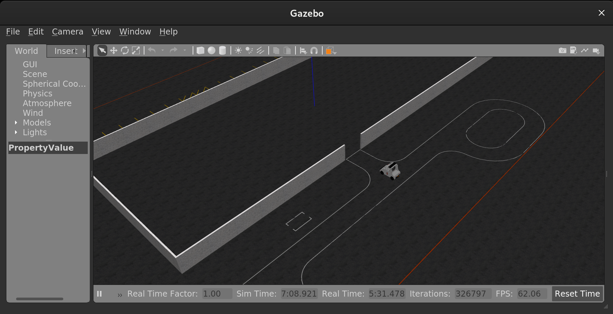
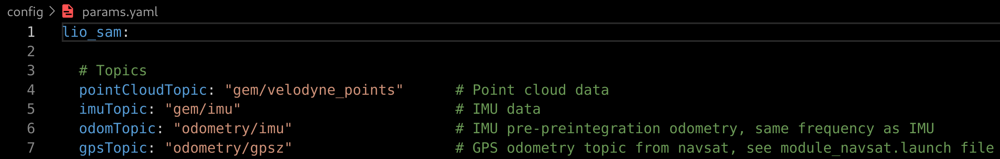
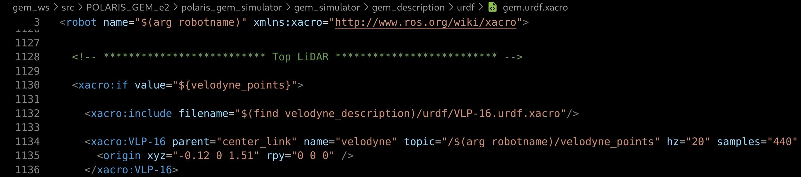
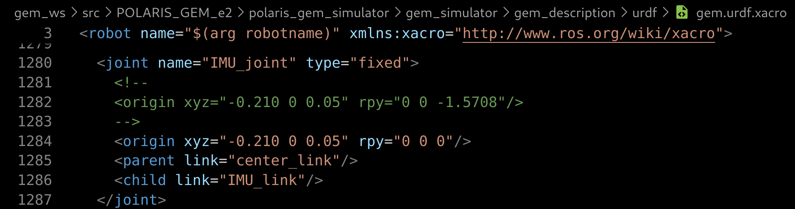
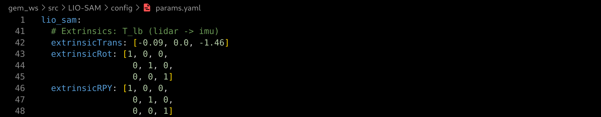
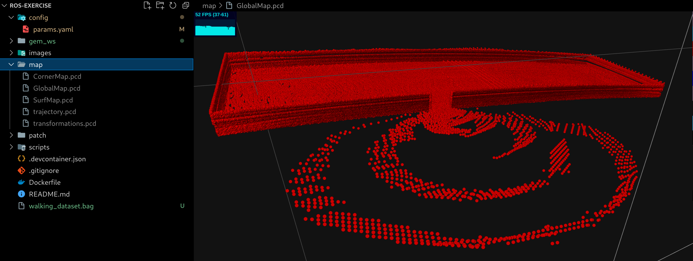
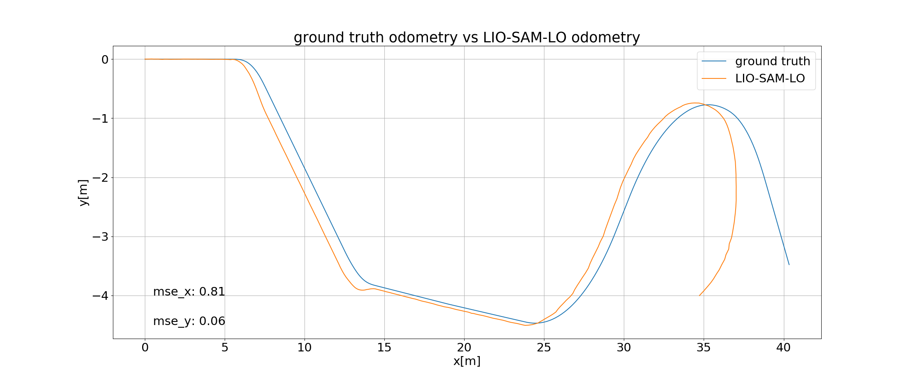

# ROS exercise
This repository is a notebook about trying to solve a proposed exercise using __ROS Noetic__ with a __Polaris gem e2__ robot simulator in __gazebo__ and available __SLAM__ library.

## Exercise tasks
1. Install the POLARIS GEM e2 simulator and apply the noetic joined [patch_gem_simulation](patch/patch_gem_simulation) update.
2. Integrate the LIO-SAM SLAM library into the simulation and apply the joined [patch_liosam](patch/patch_liosam) to handle ROS Noetic.
3. Create a map of the area using LIO-SAM
4. Modify the LIO-SAM to be able to use the generated map instead of building a new one.
    - Implementing a mechanism to load the map into the system at startup. This might involve parsing the map data and initializing certain data structures like a KD-tree.
    - LIO-SAM, as it currently stands, performs scan-matching with recent lidar scans. You would need to modify this to match incoming scans against the pre-built map.
5. Run the modified LIO-SAM using the same pre-built map and compare the results of your localization algorithm with the ground truth from the
gazebo.
6. Build a system for computing an approximative representative metric uncertainty of real-time lidar localization (covariance estimator).
    - Feel free to use any method. In a longitudinal tunnel effect, the vehicle's longitudinal uncertainty should be ideally greater than its lateral error.
    - Evaluate the covariance estimator in relation to the pose error with the ground truth.
7. Prepare the ros package to launch the robot, the world, and your modified localization system.
8. Prepare the dockerfile with all the dependencies in order to run your code and the simulation. Main requirements: ubuntu 20.04, ros noetic and gazebo 11. (A well-written readme would be really appreciated)


## Task solving trials
### 1. Setup the environment
The exercise mentions a deliverable with a Dockerfile and the desired Ubuntu, ROS and gazebo version. So I took the option to immediately begin with having a working Dockerfile.

Fortunately the ***Open Source Robotics Foundation*** responsible of ROS and Gazebo provides [docker images](https://hub.docker.com/u/osrf) and the [`osrf/ros:noetic-desktop-full`](https://hub.docker.com/layers/osrf/ros/noetic-desktop-full/images/sha256-cae9db690397b203c7d000149b17f88f3896a8240bd92a005176460cc73dfe28?context=explore) totally fits the environment specifications.

Then the provided [Dockerfile](Dockerfile) in this repository uses the `osrf/ros:noetic-desktop-full` as a base and is completed with additionnal steps and installation to fullfil Polaris GEM e2 and LIO-SAM requirements.

Since I'm using [vscode](https://code.visualstudio.com/) as an IDE, I found it convenient to use the [dev container extension](https://marketplace.visualstudio.com/items?itemName=ms-vscode-remote.remote-containers) then I'm also providing a `.devcontainer.json`. With this extension building the container is a easy a clicking on green bottom left button and choose `Reopen in container`


Once done you should have the current folder content accessible in the container terminal under the path `/workspace`

While using the container, I faced issue displaying GUI content. This is due to `docker` user by default does not have access to X11 server, to make sure GUI content can be displayed, make sure to run this command from **the host machine**.
```
xhost +local:docker
```
After that, to confirm the setting was up, I've tried to run `roscore` then `rviz` and `gazebo`. Everything were working as expected.

### 2. Install and run the POLARIS GEM e2 simulator
Installing the [POLARIS GEM e2 simulator](https://gitlab.engr.illinois.edu/gemillins/POLARIS_GEM_e2) was straight forward following the official instruction.<br>

Open a terminal in your container and make your ROS worspace directory, in our case `gem_ws`: 
```
mkdir -p /workspace/gem_ws/src
cd /workspace/gem_ws/src
```
Clone the `POLARIS GEM e2 simulator`:
```
git clone https://gitlab.engr.illinois.edu/gemillins/POLARIS_GEM_e2.git
```
Apply the simulator patch
```
cd /workspace/gem_ws/src/POLARIS_GEM_e2
git am /workspace/patch/patch_gem_simulation/simu_update.patch
```
Build your ROS workspace
```
cd /workspace/gem_ws
catkin_make
```
Source your workspace setup and you should be able to run the simulator with the following command
```
source /workspace/gem_ws/devel/setup.bash
roslaunch gem_gazebo gem_gazebo_rviz.launch world_name:=/workspace/gem_ws/src/POLARIS_GEM_e2/polaris_gem_simulator/gem_simulator/gem_gazebo/worlds/highbay_track.world x:=-5.5 y:=-21 yaw:=1.5708 velodyne_points:="true" use_rviz:="false"
```
The gazebo simulator should be opened with the robot facing the entrance of a warehouse



### 3. Teleoperating the POLARIS GEM e2 robot in gazebo
To determine how to operate the robot, I checked the `rostopic list` while the simulation is running and noticed a `/gem/cmd_vel`.<br>
Since the `cmd_vel` is usually the topic to operate robot I've tried to publish the single twist message and could see the robot moving
```
rostopic pub -l /gem/cmd_vel geometry_msgs/Twist -r 3 -- '[0.5,0,0]' '[0,0,0]'
```
Then I decide to develop my own keyboard teleoperating script to allow moving the robot. The written script [scripts/gem_teleop_keyboard.py](scripts/gem_teleop_keyboard.py) takes user keyboard inputs to increase/decrease the linear/angular velocities and publish a `geometry_msgs/Twist` to `/gem/cmd_vel`.<br>
To teleoperate the robot, you just need to launch the simulator launch file and from another terminal in container run the written script.
```
python3 /workspace/scripts/gem_teleop_keyboard.py
```


### 4. Integrate LIO-SAM
Integrating [LIO-SAM](https://github.com/TixiaoShan/LIO-SAM) is done by cloning the LIO-SAM package in our `gem_ws/src` ROS source workspace and building the workspace.<br>

N.B:
+ The additionnal library dependencies `libgtsam-dev libgtsam-unstable-dev` are directly installed in the `Dockerfile`.
+ ROS Noetic is not directly supported but [patch/patch_liosam](patch/patch_liosam) allows to solve the build issue as documented in [LIO-SAM/issues/206](https://github.com/TixiaoShan/LIO-SAM/issues/206#issuecomment-1095370894).

Open a terminal in your container and go to the ROS source worspace directory, in our case `gem_ws/src`. Then
clone the `LIO-SAM` ROS package, apply the patch and build your workspace
```
cd /workspace/gem_ws/src
git clone https://github.com/TixiaoShan/LIO-SAM.git

cd /workspace/gem_ws/src/LIO-SAM
git am /workspace/patch/patch_liosam/liosam_update.patch

cd /workspace/gem_ws
catkin_make
```
To confirm that the LIO-SAM installation is successful, I've picked a ROS bag that does not require any adjustment in those provided and run the LIO-SAM launch file. I've used the [`walking_dataset.bag`](https://drive.google.com/drive/folders/1gJHwfdHCRdjP7vuT556pv8atqrCJPbUq) and execute the `roslaunch lio_sam run.launch`.

### 5. Adjust LIO-SAM computation parameter with Polaris GEM simulator

The LIO-SAM package uses a [config/params.yaml](https://github.com/TixiaoShan/LIO-SAM/blob/master/config/params.yaml) to provide the parameters required by the computation. Some notable fields in this file are:

+ The topics: `pointCloudTopic`, `imuTopic`, `odomTopic`, `gpsTopic`
+ Extrinsics between lidar and IMU: `extrinsicTrans`,`extrinsicRot`, `extrinsicRPY`
+ Enable map saving to a corresponding folder: `savePCD`, `savePCDDirectory`

 To determine which topic to put, I've run the Polaris GEM simulator as described above and execute a `rostopic list`. The relevant topics are `/gem/velodyne_points` for point cloud data and `/gem/imu` for IMU data. Checking the LIO-SAM code, `odomTopic` is used to publish IMU data after optimisation and `gpsTopic` is used for GPS data. In my case I let those last two topic values as is. 



 The extrinsics between lidar and IMU can be determined by examining the file [polaris_gem_simulator/gem_simulator/gem_description/urdf/gem.urdf.xacro](https://gitlab.engr.illinois.edu/gemillins/POLARIS_GEM_e2/-/blob/main/polaris_gem_simulator/gem_simulator/gem_description/urdf/gem.urdf.xacro?ref_type=heads#L1135). Below a print screen providing relative pose of IMU and lidar related to robot center `center_link`
 
 
 

We can observe that both lidar and IMU have null rotation `rpy="0 0 0"`. This indicates that `extrinsicRot`, `extrinsicRPY` should be a null rotation so the identity matrix. And the translation from lidar to IMU is `extrinsicTrans=[-0.09 0 -1.46]`



To save the map I've just set `savePCD: true` and `savePCDDirectory: "/workspace"`.

From three terminals in container, I can run again the gem simulator, the keyboard teleoperate script and lio-sam with the modified params.yaml
```
roslaunch gem_gazebo gem_gazebo_rviz.launch world_name:=/workspace/gem_ws/src/POLARIS_GEM_e2/polaris_gem_simulator/gem_simulator/gem_gazebo/worlds/highbay_track.world x:=-30.5 y:=-1.5 yaw:=0 velodyne_points:="true" use_rviz:="false"

python3 /workspace/scripts/gem_teleop_keyboard.py

roslaunch lio_sam run.launch

```

This allows to visualize the following results<br>
Note: The Polaris robot has been moved inside the warehouse.


To save the map, I just called the `/lio_sam/save_map` service.
```
rosservice call /lio_sam/save_map 0.2 "/workspace/map"
```
The produced map folder contains the following files `CornerMap.pcd`, `GlobalMap.pcd`, `SurfMap.pcd`, `trajectory.pcd`, `transformations.pcd` and is available in the [map](map) folder.
Several software can be used to visualize the point cloud map, I've used the [vscode-3d-preview](https://marketplace.visualstudio.com/items?itemName=tatsy.vscode-3d-preview) extension to directly see it in vscode.


### 6. Modify the LIO-SAM to use the generated map for localization
The ROS package [LIO-SAM-LO](package/LIO-SAM-LO) is proposed to use an existing map generated by LIO-SAM and perform localization only.<br>
To use the pakage, open a terminal in your container and go to the ROS source worspace directory, in our case `gem_ws/src`. Then make a symlink to the LIO-SAM-LO package and build your workspace
```
cd /workspace/gem_ws/src
ln -s /workspace/package/LIO-SAM-LO .

cd /workspace/gem_ws
catkin_make
```
Make sure your map is available in the folder `/workspace/map` then run the run_localize launch file and your recorded rosbag. To reproduce the results I've stored a one minute record rosbag [one-minute-record.bag](https://drive.google.com/drive/folders/1EkXp5G8VEJRu8eVFWPyHbI31-YVU9Hka). Then in two different terminals in the container just run:
```
roslaunch lio_sam_lo run_localize.launch

rosbag play one-minute-record.bag
```
You should observe the map directly loaded in RViz with the robot moving inside as illustrated below.


### 7. Ground truth vs LIO-SAM localization only
The Polaris gem simulator provides the odometry ground truth in topic `/gem/base_footprint/odom` while our localize only LIO-SAM provides odometry in `/lio_sam_lo/mapping/odometry`.<br>
To compare the LIO-SAM-LO odometry to ground truth, the odometries need to be synchronized in time. So I've written a quick package **odo**metry **sync**hronizer **odo-sync**.<br>
This odo-sync package performs a soft synchronization of two odometry topics, then writes a file containing synchronized odometry data. The file can then be post-processed to compare odometry result.<br>
To integrate the pakage, open a terminal in your container and go to the ROS source worspace directory, in our case `gem_ws/src`. Then make a symlink to the odo-sync package and build your workspace
```
cd /workspace/gem_ws/src
ln -s /workspace/package/odo-sync .

cd /workspace/gem_ws
catkin_make
```
I've stored the `data/rosbag/odo-sync-one-minute-record.bag` containing the record of the two topics `/gem/base_footprint/odom` and `/lio_sam_lo/mapping/odometry` from the `one-minute-record.bag`. To get synchronized odometry data, from the container terminal, just run the odo_sync.launch after the previous build.
```
source /workspace/gem_ws/devel/setup.bash
roslaunch /workspace/gem_ws/src/odo-sync/launch/odo_sync.launch
```
You should have the file `/workspace/data/odo_sync/odo_sync.txt` containing the synchronized odometries. This file contain timestamp, ground truth position [x,y,z] and localize only LIO-SAM odometry position [x,y,z]. I've made a quick python script [gem_gt_vs_lio_sam_lo.py](scripts/gem_gt_vs_lio_sam_lo.py) to plot the ground truth odometry versus the LIO-SAM-LO one.<br>

Note:<br>
+ To compare odometries, initial robot position have been substrated to ground truth position.
+ Also just for the exercise purpose, initial robot frame and world frame are aligned. Else it would have been required to transform lio-sam odometry to world system coordinate, for that [scipy.spatial.transform.Rotation.align_vectors](https://docs.scipy.org/doc/scipy/reference/generated/scipy.spatial.transform.Rotation.align_vectors.html) can be used for example to determine the rigid transformation between the two frame.

Run the python script to display ground truth and LIO-SAM-LO trajectories and associated Mean Square Error (MSE). I've joined to the repository a record of synchronized odometry data btu you could alos use antoher one produced by the `odo-sync` package.
```
python3 /workspace/scripts/gem_gt_vs_lio_sam_lo.py /workspace/data/odo_sync/odo_sync_recorded.txt
```



Observations:<br>
+ At the end of the `one-minute-record.bag`, the robot make a u-turn and get lost which increase the positionning error. This due to the fact inside the warehouse of the `highbay_track.world`, there are only wall and no significant content to allow to retrieve itself.